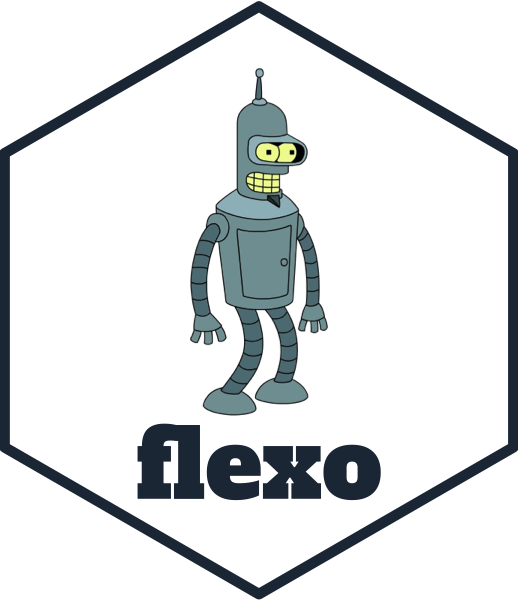

<!-- README.md is generated from README.Rmd. Please edit that file -->

# flexo: Simple Lex/Parse Tools in R 

<!-- badges: start -->


 [](https://github.com/coolbutuseless/flexo/actions)
<!-- badges: end -->

`flexo` provides tools for simple tokenising/lexing/parsing of text
files.

`flexo` aims to be useful in getting otherwise unsupported text data
formats into R.

## What’s in the box

-   `lex(text, regexes)` break a text string into tokens using the
    supplied regular expressions
-   `TokenStream` is an R6 class for manipulating a stream of tokens - a
    first step for parsing the data into a more useful format
-   `create_stream()` is a base R version of `TokenStream` which uses
    environments directly

## Installation

You can install `flexo` from [github
coolbutuseless/flexo](https://github.com/coolbutuseless/flexo) with

``` r
# install.packages('remotes')
remotes::install_github('coolbutuseless/flexo', ref='main')
```

## Usage Overview

-   Define a set of regular expressions (`regexes`) that define the
    tokens in the data
-   Call `lex()` to use these `regexes` to split data into tokens
    i.e. `lex(text, regexes)`
-   `lex()` returns a named character vector of tokens. The names of the
    tokens correspond to the respective regex which captured it.
-   Optionally use the `TokenStream`
    [R6](https://cran.r-project.org/package=R6) class to aid in the
    manipulation of the raw tokens into more structured data.
-   New in v0.2.5 use a base R environment-based token stream iniated
    with `create_stream(tokens)`

I often do not import the `flexo` package for projects, but instead copy
the `lex.R` and `stream.R` files into the new package. This avoids
having a non-CRAN dependency on an otherwise simple project.

## Limitations

For complicated parsing (e.g. programming languages) you’ll want to use
the more formally correct lexing/parsing provided by the [`rly`
package](https://cran.r-project.org/package=rly) or the [`dparser`
package](https://cran.r-project.org/package=dparser).

## Vignettes

Vignettes are available to read
[online](https://coolbutuseless.github.io/package/flexo)

-   [Parsing Chess games in PGN
    format](https://coolbutuseless.github.io/package/flexo/articles/chess.html)
-   [Parsing 3d models in OBJ
    format](https://coolbutuseless.github.io/package/flexo/articles/parse_obj.html)
-   [Parsing Scrabble games in GCG
    format](https://coolbutuseless.github.io/package/flexo/articles/Scrabble.html)
-   [Parsing PBRT scene description
    format](https://coolbutuseless.github.io/package/flexo/articles/PBRT.html)

## Example: Using `lex()` to split sentence into tokens

``` r
sentence_regexes <- c(
  word        = "\\w+", 
  whitespace  = "\\s+",
  fullstop    = "\\.",
  comma       = ","
)

sentence = "Hello there, Rstats."

flexo::lex(sentence, sentence_regexes)
```

    ##       word whitespace       word      comma whitespace       word   fullstop 
    ##    "Hello"        " "    "there"        ","        " "   "Rstats"        "."

## Example: Using `lex()` to split some simplified R code into tokens

``` r
R_regexes <- c(
  number      = "-?\\d*\\.?\\d+",
  name        = "\\w+",
  equals      = "==",
  assign      = "<-|=",
  plus        = "\\+",
  lbracket    = "\\(",
  rbracket    = "\\)",
  newline     = "\n",
  whitespace  = "\\s+"
)

R_code <- "x <- 3 + 4.2 + rnorm(1)"

R_tokens <- flexo::lex(R_code, R_regexes)
R_tokens
```

    ##       name whitespace     assign whitespace     number whitespace       plus 
    ##        "x"        " "       "<-"        " "        "3"        " "        "+" 
    ## whitespace     number whitespace       plus whitespace       name   lbracket 
    ##        " "      "4.2"        " "        "+"        " "    "rnorm"        "(" 
    ##     number   rbracket 
    ##        "1"        ")"

## Example: Using `lex()` with `TokenStream`

Once `lex()` is used to create the separate tokens, the next step is to
intepret the token sequence into something much more structured e.g. a
data.frame or matrix.

The example below shows `flexo` being used to to parse a hypothetical
tic-tac-toe game format into a matrix.

``` r
#~~~~~~~~~~~~~~~~~~~~~~~~~~~~~~~~~~~~~~~~~~~~~~~~~~~~~~~~~~~~~~~~~~~~~~~~~~~~
# A tough game between myself and Kasparov (my pet rock)
# The comment line denotes who the game was between
# Each square is marked with an 'X' or 'O'
# After each X and O is a number indicating the order in which the mark
# appeared on the board.
#~~~~~~~~~~~~~~~~~~~~~~~~~~~~~~~~~~~~~~~~~~~~~~~~~~~~~~~~~~~~~~~~~~~~~~~~~~~~
game <- "
# Kasparov(X) vs Coolbutuseless(O)
  X2 | O1 | O5 
  O3 | X4 | X6
  X7 | O8 | X9
"

#~~~~~~~~~~~~~~~~~~~~~~~~~~~~~~~~~~~~~~~~~~~~~~~~~~~~~~~~~~~~~~~~~~~~~~~~~~~~
# Define all the regexes to split the game into tokens
#~~~~~~~~~~~~~~~~~~~~~~~~~~~~~~~~~~~~~~~~~~~~~~~~~~~~~~~~~~~~~~~~~~~~~~~~~~~~
game_regexes <- c(
  comment     = "(#.*?)\n", 
  whitespace  = "\\s+",
  sep         = "\\|",
  mark        = "X|O",
  order       = flexo::re$number
)

#~~~~~~~~~~~~~~~~~~~~~~~~~~~~~~~~~~~~~~~~~~~~~~~~~~~~~~~~~~~~~~~~~~~~~~~~~~~~
# Use flexo::lex() to break game into tokens with these regexes
#~~~~~~~~~~~~~~~~~~~~~~~~~~~~~~~~~~~~~~~~~~~~~~~~~~~~~~~~~~~~~~~~~~~~~~~~~~~~
tokens <- flexo::lex(game, game_regexes)

#~~~~~~~~~~~~~~~~~~~~~~~~~~~~~~~~~~~~~~~~~~~~~~~~~~~~~~~~~~~~~~~~~~~~~~~~~~~~
# Remove some tokens that don't contain actual information
#~~~~~~~~~~~~~~~~~~~~~~~~~~~~~~~~~~~~~~~~~~~~~~~~~~~~~~~~~~~~~~~~~~~~~~~~~~~~
tokens <- tokens[!names(tokens) %in% c('whitespace', 'comment', 'sep')]

tokens
```

    ##  mark order  mark order  mark order  mark order  mark order  mark order  mark 
    ##   "X"   "2"   "O"   "1"   "O"   "5"   "O"   "3"   "X"   "4"   "X"   "6"   "X" 
    ## order  mark order  mark order 
    ##   "7"   "O"   "8"   "X"   "9"

``` r
#~~~~~~~~~~~~~~~~~~~~~~~~~~~~~~~~~~~~~~~~~~~~~~~~~~~~~~~~~~~~~~~~~~~~~~~~~~~~
# Create a TokenStream object for help in manipulating the tokens
# Obviously there are easier ways to do this on such a simple example, but 
# the below example is hopefully illustrative of the technique
#~~~~~~~~~~~~~~~~~~~~~~~~~~~~~~~~~~~~~~~~~~~~~~~~~~~~~~~~~~~~~~~~~~~~~~~~~~~~
stream <- TokenStream$new(tokens)

mark  <- c()
order <- c()

#~~~~~~~~~~~~~~~~~~~~~~~~~~~~~~~~~~~~~~~~~~~~~~~~~~~~~~~~~~~~~~~~~~~~~~~~~~~~
# Keep processing all the tokens until done.  
# The tokens should exist in pairs of 'mark' and 'order', so assert that pairing
# Consume and store the values from the stream into 'mark' and 'order' vectors
# Bind all the information into a matrix
#~~~~~~~~~~~~~~~~~~~~~~~~~~~~~~~~~~~~~~~~~~~~~~~~~~~~~~~~~~~~~~~~~~~~~~~~~~~~
while (!stream$end_of_stream()) {
  stream$assert_name_seq(c('mark', 'order'))
  mark  <- c(mark , stream$consume(1))
  order <- c(order, stream$consume(1))
}

cbind(mark, order)
```

    ##      mark order
    ## mark "X"  "2"  
    ## mark "O"  "1"  
    ## mark "O"  "5"  
    ## mark "O"  "3"  
    ## mark "X"  "4"  
    ## mark "X"  "6"  
    ## mark "X"  "7"  
    ## mark "O"  "8"  
    ## mark "X"  "9"
